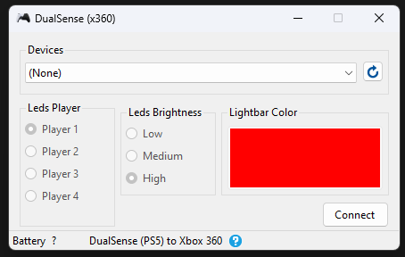
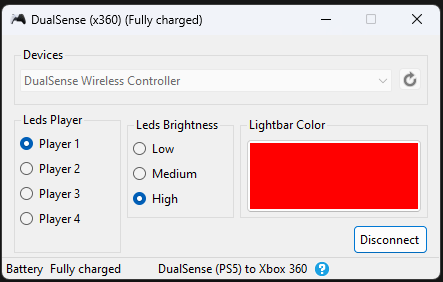
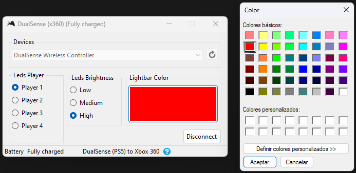
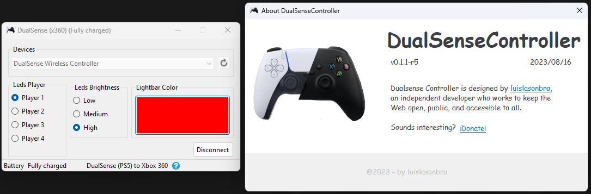

# DualSenseController
Emulate Xbox 360 Controller while also getting the functionality of a DualSense Controller

## **Screenshot:**

# About App
### App only works with the `PS5 Controller DualSense`

Bring your DualSense Controller to life on PC with support for Adaptive Triggers!

Emulate with the following while also getting the functionality of a DualSense Controller:

`Xbox360`

Whether you're using Steam or a different platform, you will be able to use DualSenseX with all games!

Connection type supports both USB and Bluetooth with full functionality!

## Download and Install

To use DualSenseController,

* Download the **DualSenseController_v0.1.1-r5.zip** in Assets from the [latest release](https://github.com/luislasonbra/DualSenseController/releases/latest).  
    * To Extract file, double-click `DualSenseController.exe`.

* Very important and required get ViGEmBus Driver:
    * Download the latest `ViGEmBus` drivers from the [ViGEmBus release page](https://github.com/ViGEm/ViGEmBus/releases/latest).  
    * To install, double-click `ViGEmBus_Setup_{version}.exe` and follow the instructions presented.
    
* HidHide Driver (OPTIONAL):
    * Download the latest `HidHide` drivers from the [HidHide release page](https://github.com/ViGEm/HidHide/releases/latest).  
    * To install, double-click `HidHideMSI.msi` and follow the instructions presented.
    * **MAKE SURE YOU REBOOT TO TAKE EFFECT**

## **Features:**
- Get Battery life status of controller.
- Configure Controller LED to your liking.
- Configure Controller LED Brightness to your liking.
- Custom Light Bar Color.
- and many more...

# Donation
If you like my work and want to support future projects, you can make a donation:
- via [Paypal](https://www.paypal.com/donate/?hosted_button_id=QEMXHPY5LG4AQ)
